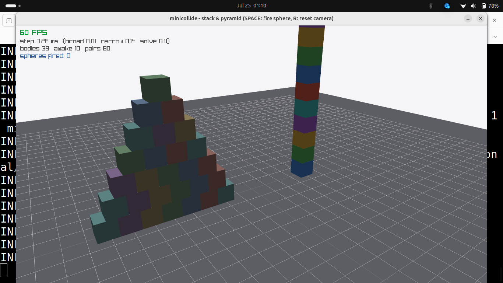
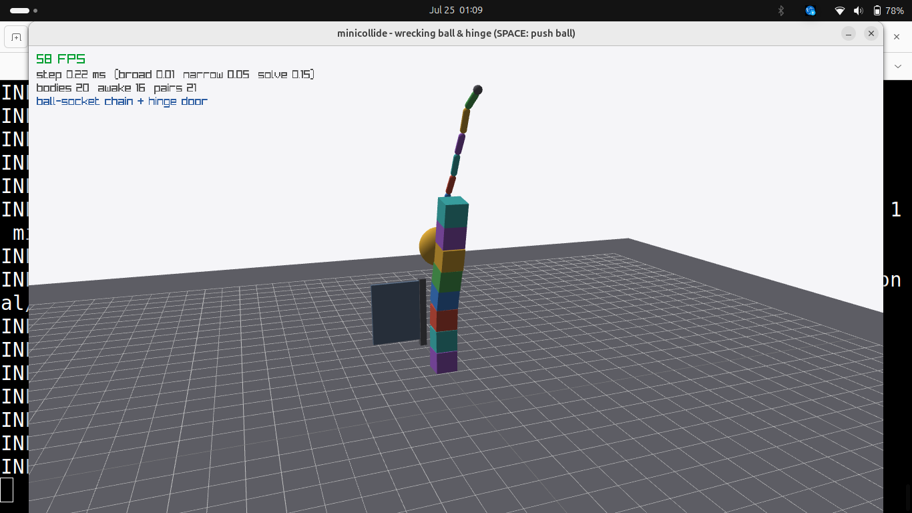
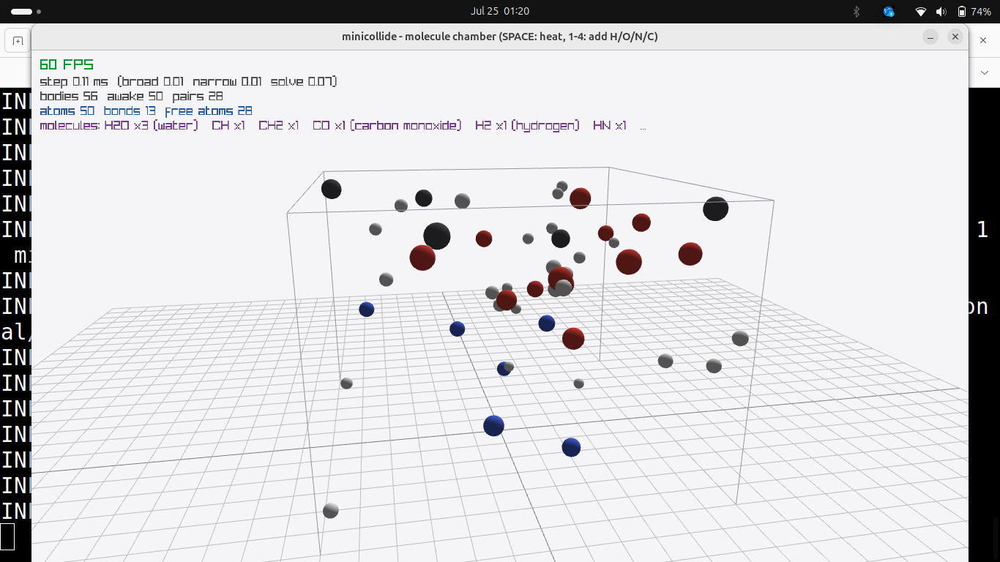
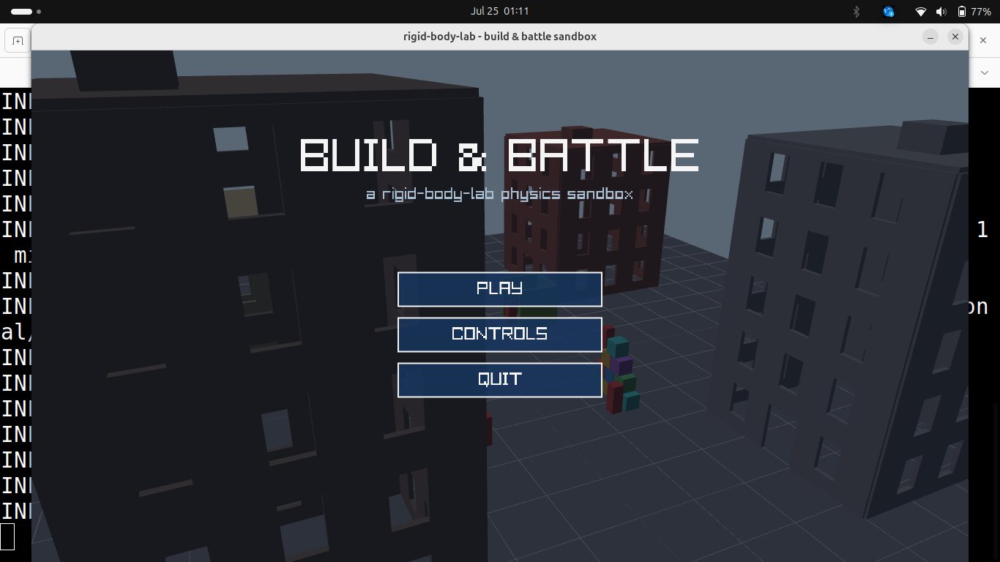

# rigid-body-lab

A compact laboratory for real time rigid body dynamics, built around **minicollide**, a dependency free C++20 3D physics engine implemented from scratch.

The repository includes:

* Collision detection and contact generation
* Rigid body constraint solving
* Persistent manifolds and warm starting
* Multithreaded island solving
* SIMD experiments
* Deterministic simulation
* UDP snapshot networking
* Instrumented benchmarks
* Interactive gameplay and physics demos
* A companion theory reading list

I built this project to understand how production physics engines work by implementing the underlying algorithms directly rather than treating them as black boxes.

The engine is roughly 3,000 lines of dependency free C++20. `raylib` is fetched only for the demo viewers.

Each section below connects the implementation to the design questions and theory behind it.

Companion reading list: [PAPERS.md](PAPERS.md)

## Demos at a glance

### `demo_stack`



A 10 box tower and 5 layer pyramid running at 60 FPS.

This is the main stress test for the box versus box SAT and clipping pipeline. Stable stacking depends on each box pair generating a persistent contact manifold with up to four contact points and carrying accumulated impulses across frames.

The live overlay shows:

* Broadphase time
* Narrowphase time
* Solver time
* Body count
* Candidate pair count

Press `SPACE` to launch a sphere into the structures.

### `demo_chain`



A wrecking ball hangs from a chain of ball socket joints beside a hinged door and a box tower.

The scene exercises joint constraints and contacts inside the same island solve:

* 3×3 ball socket constraint blocks
* Hinge angular constraint rows
* Contact constraints
* Sequential impulse solving

Press `SPACE` to push the wrecking ball through the tower and into the door.

### `demo_molecules`



A zero gravity reaction chamber where atoms drift, collide, and form simple molecules.

Atoms use CPK inspired colors:

* H: white
* O: red
* N: blue
* C: dark

The chemistry is driven entirely by the physics engine.

When two touching atoms both have available valence, the demo creates a ball socket joint at the contact point. A union find structure over the resulting bond graph identifies connected molecules.

The HUD reports molecules such as:

```text
H2O x3 (water)
CO x1 (carbon monoxide)
H2 x1 (hydrogen)
```

Controls:

```text
SPACE   Add heat by injecting random impulses
1       Add hydrogen
2       Add oxygen
3       Add nitrogen
4       Add carbon
```

### `demo_fort`



A small Build & Battle sandbox driven entirely by the physics engine without modifying the engine itself.

The demo includes:

* First person movement
* Grid snapped wall, floor, and ramp placement
* Physical projectile pooling
* Hit points on structures
* Destructible static geometry
* Dynamic collapse through the normal solver

When a panel reaches zero HP, it changes from static to dynamic and collapses naturally under the physics simulation.

## Build and run

Requirements:

* C++20 compiler
* CMake
* AVX2 capable CPU for the SIMD benchmark
* `raylib` only when building demo viewers

```bash
cmake -B build -DCMAKE_BUILD_TYPE=Release
cmake --build build -j

cd build

ctest
./mc_bench

./demo_stack
./demo_chain
./demo_pile
./demo_fort
./demo_molecules

./net_server &
./net_client
```

To build without the raylib demos:

```bash
cmake -B build -DCMAKE_BUILD_TYPE=Release -DMC_BUILD_DEMOS=OFF
cmake --build build -j
```

### Useful commands

Run unit, integration, stability, and determinism tests:

```bash
ctest
```

Run SIMD kernel and multithreading benchmarks:

```bash
./mc_bench
```

Run the 10 box tower and pyramid demo:

```bash
./demo_stack
```

Press `SPACE` to launch a sphere.

Run the wrecking ball, chain, and hinge door demo:

```bash
./demo_chain
```

Drop 600 mixed bodies into a pile and display the live profiler:

```bash
./demo_pile [threads]
```

Run the Build & Battle sandbox:

```bash
./demo_fort
```

Place walls and ramps, fire projectiles, destroy targets, and collapse structures.

Run the zero gravity reaction chamber:

```bash
./demo_molecules
```

Atoms can form molecules such as H2O, CO2, and CH4.

Start the authoritative simulation server at 60 Hz with UDP snapshots sent at 20 Hz:

```bash
./net_server &
```

Start the interpolating network viewer:

```bash
./net_client
```

Press `SPACE` to apply an impulse to the server simulation.

Run a headless verification of the snapshot stream:

```bash
./net_client --probe 100
```

## Simulation pipeline

`World::step`, implemented in `src/core/world.cpp`, follows a fixed timestep rigid body pipeline:

```text
integrate velocities
    semi implicit Euler
    gravity
    damping

        ↓

broadphase
    sweep and prune
    fattened AABBs

        ↓

parallel narrowphase
    analytic tests
    SAT
    GJK + EPA

        ↓

contact manifolds
    persistent contact matching
    warm started impulses

        ↓

constraint islands
    union find over the constraint graph

        ↓

parallel island solve
    sequential impulses
    10 velocity iterations

        ↓

integrate positions
    quaternion derivative
    quaternion normalization

        ↓

island based sleeping
```

## Architecture and implementation notes

### Math

Location:

```text
src/math/math.h
```

The math layer contains hand written implementations of:

* `Vec3`
* `Mat3`
* `Quat`
* `Transform`

Orientation is represented by a quaternion and integrated using:

```text
q' = q + 0.5 * (omega q) * dt
```

The quaternion is normalized after integration.

The world space inverse inertia tensor is rebuilt each step as:

```text
R * I_local^-1 * R^T
```

#### Why semi implicit Euler?

Velocity is updated before position, and the new velocity is then used for position integration.

It has approximately the same cost as explicit Euler but behaves much better for oscillatory mechanical systems, which is why it is widely used in real time physics engines.

## Collision detection

Location:

```text
src/collision/
```

### Broadphase

The broadphase uses sweep and prune along the X axis with margin expanded AABBs.

Complexity is dominated by:

```text
O(n log n)
```

for sorting, followed by a near linear sweep through potential overlaps.

The implementation provides a useful place to explore:

* Sweep and prune versus dynamic BVHs
* Incremental sorting
* Temporal coherence
* Fat AABB margins

### Box versus box

Box collision uses SAT over 15 candidate axes:

```text
6 face normals
9 edge cross product axes
```

A bias prefers face axes when possible.

Once the separating axis test identifies penetration, the incident face is clipped against the reference face side planes using Sutherland Hodgman clipping.

The resulting manifold can contain up to four contact points.

This is especially important for stacking. A box supported by a four point manifold is substantially more stable than one supported by a single contact point.

### GJK and EPA

Implementation:

```text
src/collision/gjk.cpp
```

GJK computes distance and witness points using barycentric closest point calculations on the current simplex.

EPA expands the final simplex into a polytope to determine penetration normal and depth.

The implementation is used for capsule versus box collision by testing the capsule inner segment and adding the radius afterward.

This follows the shrunk shape and margin approach described by van den Bergen.

### Sphere and capsule tests

Simple primitive combinations use analytic closest point routines, including segment versus segment tests.

### Persistent manifolds

Contact points are matched between frames using local anchor proximity.

This allows accumulated contact impulses to survive between simulation steps.

That persistence makes warm starting possible and significantly improves solver convergence.

## Constraint solver

Location:

```text
src/solver/
```

The solver uses sequential impulses, equivalent to projected Gauss Seidel applied to the contact constraint system.

For each contact point, the solver computes an effective mass:

```text
1 / (J M^-1 J^T)
```

The accumulated normal impulse is constrained to remain nonnegative.

Friction uses two tangent directions with impulses bounded by:

```text
mu * Pn
```

Position drift is handled with Baumgarte stabilization:

```text
beta / dt * max(penetration - slop, 0)
```

Restitution is applied only above a velocity threshold.

Joint constraints use the same solver framework:

* Ball socket joint: 3×3 block
* Hinge joint: positional block plus two angular rows

Contacts and joints are solved together inside each island iteration.

### Solver questions explored

#### Accumulated impulse clamping

Impulse deltas can be negative as long as the accumulated impulse remains valid.

This is an important detail in projected Gauss Seidel convergence.

#### Warm starting

Contact impulses from the previous frame initialize the next solver pass.

The stack stability test demonstrates how strongly stable stacking depends on this temporal coherence.

#### Baumgarte stabilization

The current engine uses Baumgarte stabilization for penetration correction.

Alternatives include split impulse or nonlinear Gauss Seidel position correction, which can avoid some forms of energy injection.

#### Mass ratios

Large mass ratios, especially heavy objects resting on much lighter objects, are a classic difficult case for iterative sequential impulse solvers.

## Parallelism

Locations:

```text
src/parallel/
src/core/world.cpp
```

Dynamic bodies are grouped into independent constraint islands using union find.

Static bodies participate in constraints but do not merge otherwise independent islands.

Independent islands can therefore be solved concurrently.

The engine parallelizes two major stages:

* Narrowphase processing across candidate pairs
* Solver work across independent islands

### Determinism

Threading does not change the final simulation state.

Work is indexed by input order rather than appended in completion order, and the solve order inside each island remains fixed.

As a result, runs with different thread counts produce bit identical simulation state.

`ctest` verifies this using state hashes.

This kind of deterministic execution is especially relevant to networked or distributed simulations where reproducibility across machines matters.

## SIMD

Benchmark implementation:

```text
bench/bench_main.cpp
```

The benchmark contains an AVX2 version of the normal impulse row update processing eight contacts at once using structure of arrays data.

On the development machine, the kernel measures roughly:

```text
6x
```

the scalar implementation.

Sequential Gauss Seidel introduces an important limitation: constraint rows that modify the same rigid body cannot simply be processed simultaneously.

Production engines often solve this using graph coloring.

Contacts are grouped so that no two rows in the same group modify the same body. Each color can then be processed with SIMD.

Inside a color, the update becomes more Jacobi like, which introduces a real tradeoff between SIMD throughput and solver convergence.

The benchmark also provides a place to explore techniques such as mass splitting from Tonge 2012.

## Performance and Amdahl's law

`mc_bench` reports timings for each simulation phase.

On the 1,300 body benchmark scene, the solver phase improves by roughly:

```text
1.8x on 4 cores
```

while total frame performance improves by approximately:

```text
1.3x
```

The difference comes from serial work that remains outside the parallel solver, including:

* Broadphase sorting
* Manifold map maintenance

This demonstrates Amdahl's law directly.

Optimizing the already parallel portion of the engine eventually provides diminishing returns if the remaining serial fraction is not addressed.

Possible future directions include:

* Parallel radix sorting for sweep and prune
* Sharded manifold maps

## Networked physics

Location:

```text
net/
```

The networking experiment uses an authoritative server architecture.

Server simulation:

```text
60 Hz
```

Snapshot transmission:

```text
20 Hz UDP
```

Each snapshot currently contains the full simulation state and is sent as a single datagram.

The client renders approximately:

```text
100 ms
```

behind the server simulation.

It finds the two snapshots surrounding the render timestamp and interpolates between them using:

* Linear interpolation for position
* Normalized linear interpolation for orientation

This is the classic snapshot interpolation model described by Fiedler and Valve.

Probe mode:

```bash
./net_client --probe 100
```

performs a headless machine check of snapshot stream continuity.

Another class of networked simulation distributes simulation ownership across clients rather than keeping all physics authoritative on one central server.

That introduces additional questions around:

* Consistency
* Trust
* Ownership migration
* Synchronization between machines

These are natural areas for future experiments.

## Gameplay sandbox

Location:

```text
demos/demo_fort.cpp
```

`demo_fort` demonstrates the engine being used like a small game engine without requiring special physics modifications.

The player is represented by a capsule with zero inverse inertia so the character cannot tip over.

Grounded state is determined from contact manifolds.

Build mode places:

* Walls
* Floors
* Ramps

onto a 3 meter grid.

Placed structures begin as static rigid bodies with hit points.

Projectiles come from a recycled pool because the current world implementation does not support body removal.

When a structure reaches zero HP, it changes from static to dynamic and collapses under the normal rigid body solver.

### An emergent contact manifold example

An upright capsule used as a target dummy balances on a single contact point and easily falls over.

Replacing it with a slender box gives the target a four point support manifold.

The box therefore remains upright until something actually hits it.

This provides a simple visual example of why manifold quality matters.

## Molecular sandbox

Location:

```text
demos/demo_molecules.cpp
```

The molecular demo uses the existing engine primitives without adding chemistry specific functionality to the physics engine.

Atoms are represented as spheres with CPK inspired colors and simple chemical valence limits:

| Element | Valence |
| --- | ---: |
| H | 1 |
| O | 2 |
| N | 3 |
| C | 4 |

The chamber has zero gravity and elastic walls.

Each frame, the demo examines the engine's contact manifolds.

When two touching atoms both have free valence, the demo:

1. Consumes one valence from each atom.
2. Creates a ball socket joint at the contact point.

In other words, the collision system becomes the event source for runtime bond creation.

A demo side union find structure groups bonded atoms into connected molecules.

This is the same class of data structure the engine uses internally for constraint islands.

The HUD recognizes molecules such as:

```text
H2O
CO2
CH4
NH3
```

Pairs already belonging to the same molecule are skipped, keeping the generated bond graph acyclic and allowing the census to remain a simple tree traversal.

Pressing `SPACE` injects random impulses into the atoms, effectively heating the chamber and increasing collision frequency.

The element masses are scaled rather than using their true atomic weights.

This is intentional because extreme mass ratios reduce convergence quality in the current projected Gauss Seidel solver.

Ball socket joints also allow molecules to remain flexible.

Rigid molecular geometry would require additional constraint types such as:

* Weld joints
* Articulated rigid body techniques
* Featherstone style reduced coordinate articulations

## Sleeping

Bodies that remain below velocity thresholds for:

```text
0.5 s
```

become inactive.

Sleeping happens at the island level rather than per body.

A body cannot sleep while another connected body in its island remains active.

Any active body in the island wakes the rest.

Losing a supporting contact also wakes a sleeping body.

Sleeping bodies are rendered with reduced saturation in the demos.

## Testing

Tests are implemented in:

```text
tests/test_main.cpp
```

Coverage includes:

* Vector, matrix, and quaternion identities
* GJK distance results
* GJK witness points
* EPA penetration depth
* Four point box contact manifolds
* Drop and settle behavior
* Five box stack stability over 10 seconds
* Pendulum constraint drift below 5 cm
* Capsule resting height
* Determinism across thread counts using state hashing

Run all tests with:

```bash
ctest
```

## Current limitations and future experiments

The following areas are intentionally outside the current scope:

* Continuous collision detection using speculative contacts or conservative advancement
* Split impulse or nonlinear Gauss Seidel position correction instead of pure Baumgarte stabilization
* Dynamic BVH broadphase with incremental updates
* Graph colored SIMD solving inside the main engine loop
* Convex hull and mesh colliders
* Client side prediction and reconciliation
* Delta compressed and quantized network snapshots
* Featherstone reduced coordinate articulations for ragdolls

GJK already operates through support functions, so convex hull support is a natural extension to the current collision architecture.

## Why this project exists

The goal of `rigid-body-lab` is not to replace a production physics engine.

It is a small enough codebase to study end to end while still containing many of the ideas that make modern real time rigid body engines interesting:

* Collision detection
* Persistent contact generation
* Iterative constraint solving
* Temporal coherence
* Parallel execution
* SIMD optimization
* Deterministic simulation
* Sleeping
* Networking
* Gameplay integration

The emphasis is on implementing the algorithms, measuring their behavior, and understanding the engineering tradeoffs behind them.

